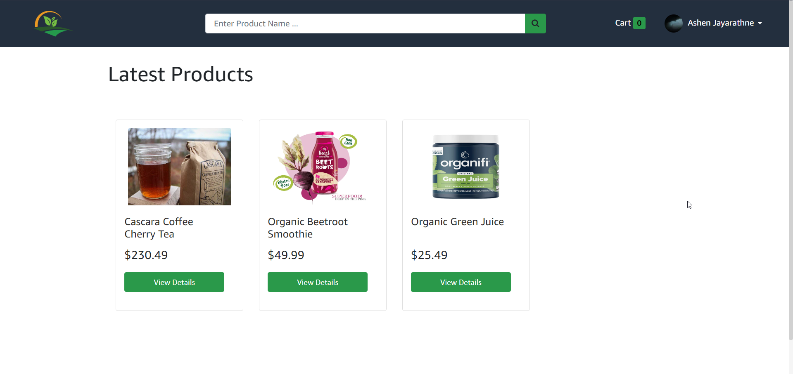
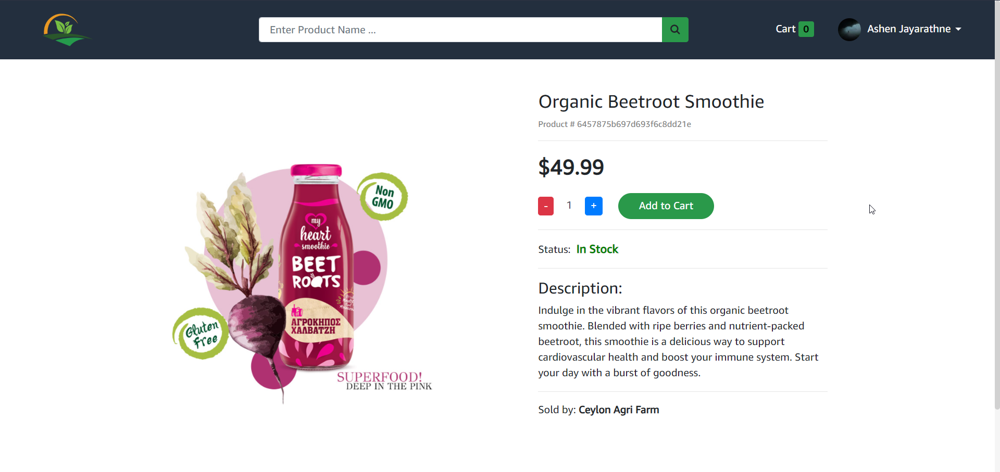
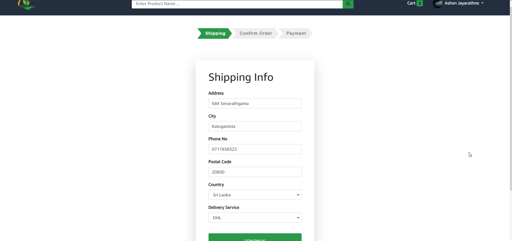
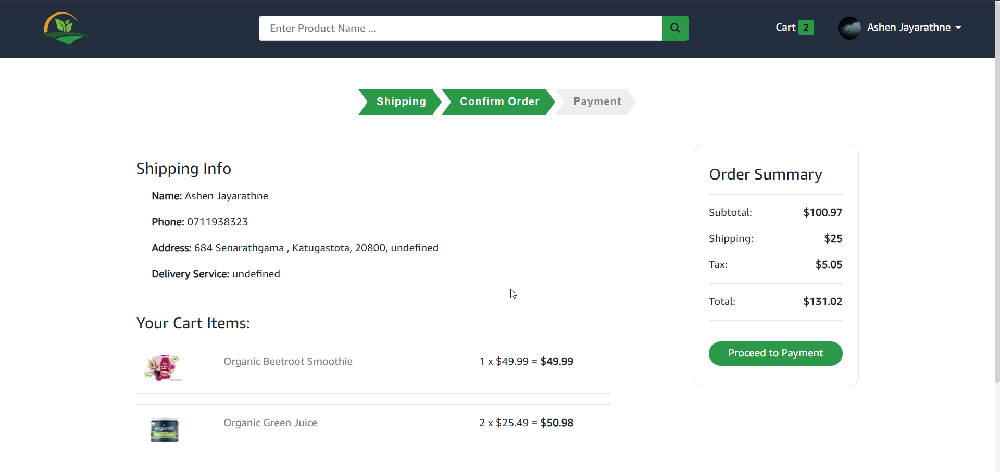
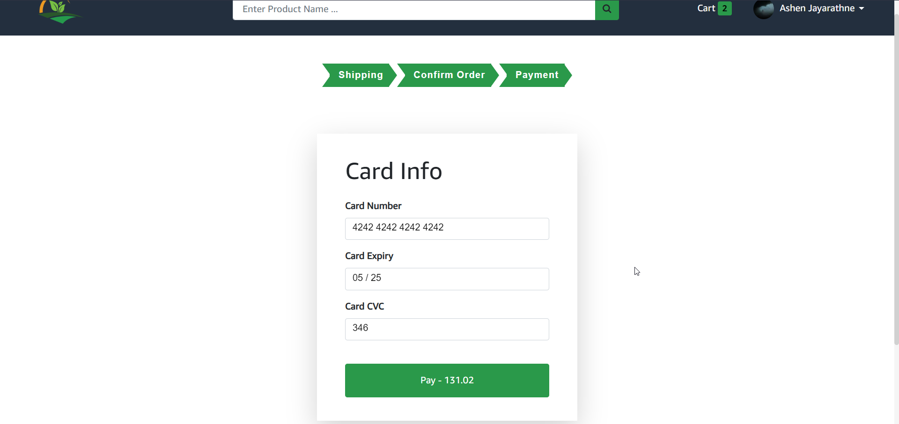
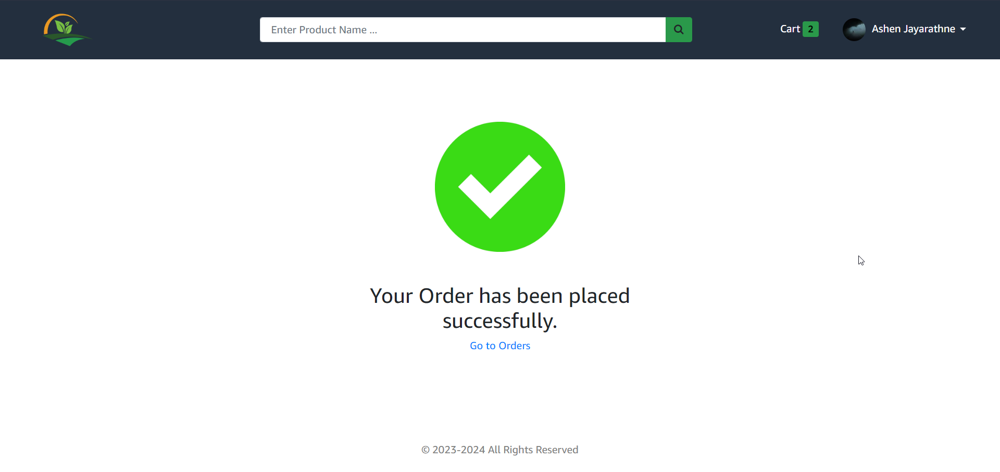

# Sustainable-Agriculture-Marketspace-

## Technologies & services used to develop this application

React Js
Redux
Node Js
Express
MongoDB
Third-party payment API (Stripe API)
Third-party email service (Outlook API)

### Install Backend Dependencies

```bash
npm install
```

### Starting Backend Service

```bash
npm run dev
```

### Install Frontend Dependencies

```bash
cd frontend/
npm install
```

### Starting Frontend Service

```bash
npm start
```

## User Interfaces of this application















